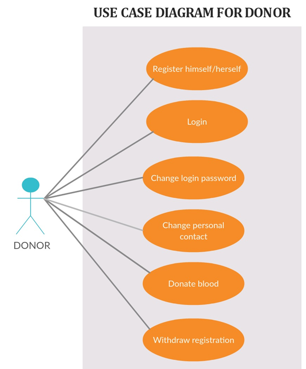
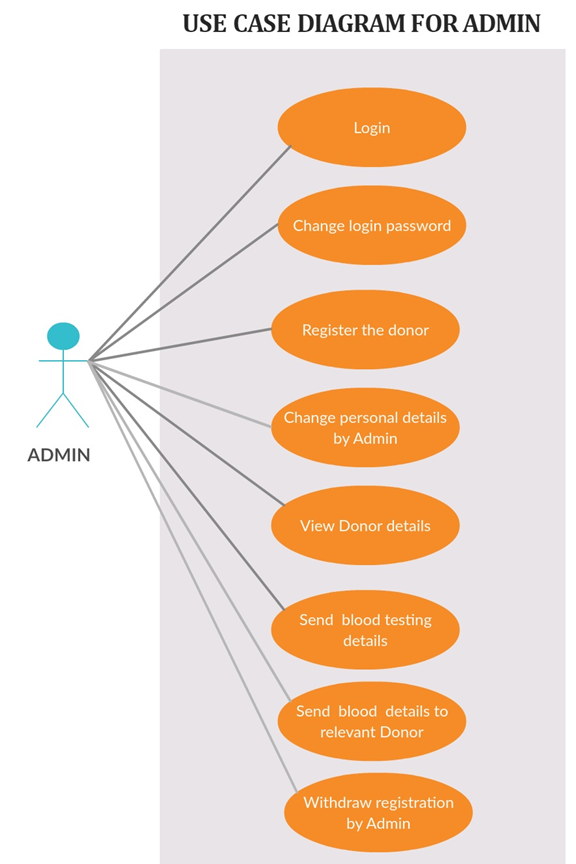
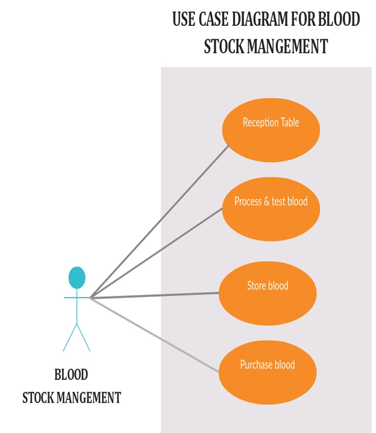
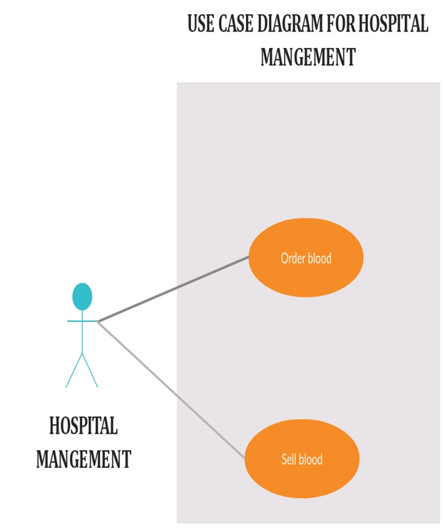

# Software Requirement Specifications (SRS) on Blood Bank Management System

    

## Introduction

Blood sales and blood purchase are entered and maintained in this project. Blood stock reports, sales reports and blood purchase reports are managed in this project. It will help us to find the blood group with its most efficient time to take care of  the blood and it is more easy to hand over the blood to the hospitals to help people to get blood on time. This all thing is been stored and been seen in this Blood Bank Management System.To help more people trying best to do so.

## Objective

The main objective of this specification is to support the automated tracking of blood products from the initial ordering of a blood transfusion for a patient, through to the taking of a blood sample for cross matching, to administration of a blood transfusion and subsequent updates to care records. To allow the probable recipients to make search and match the volunteer donors, and make request for the blood. 

## Purpose

Blood Bank Management Software is designed & suitable for several Blood Bank either operating as individual organization or part of Hospital. It covers all Blood banking process from Donor recruitment, donor management, mobile sessions, component preparation, screening covering all tests, blood stock inventory maintenance, patient registration, cross matching, patient issues etc.

## Intended User

Anybody can use this BBMS to Donor as well as who need blood e.g., Public,
Hospitals, Blood Banks etc.

## Project Scope

The scope of the specification includes the following scenarios:

1.	Routine blood transfusion;
2.	Transfusion for special requirements (for example, cytomegalovirus (CMV)seronegative blood, irradiated blood or antigen negative blood);
3.	Emergency issue of blood;
4.	Management of returned and unused blood units.

# Overall Description:

## Product Prospective: 

1.	To provide a means for the blood bank to publicize and advertise blood donation programs.
2.	To provide an efficient donor and blood stock management functions to the blood bank by recording the donor and blood details.
3.	To improve the efficiency of blood stock management by alerting the blood bank staffs when the blood quantity is below it par level or when the blood stock has expired.
4.	To provide pure blood with no wastages blood is been collected in different types of packs. They are double, triple, and triple (AS), quadruple pack.
5.	To provide synchronized and centralized donor and blood stock database.
6.	To provide immediate storage and retrieval of data and information.

## Product Features

### Login Interface:

User should enter the valid username and password to get access to its profile.

### Donor Profile:

User will be able to see its Account No. The receipts of
the blood donated to the bank, Donation to the Bank, Need of the Blood to the Bank and Request for Blood.

### Blood Stock Management:

It will show the Blood Detailed of the specific
bottle with its Full Donor Detail or Account No. if he/she is registered to the Bank.

### Report:

It will be available on the Admin’s Profile and will show the
Availability of the Blood Groups with its no. of available bottle as per admin’s
choice to view the report as Month, Day, or Year.

## Operating Environment

1.	Operating system : Linux
2.	Intel P4 1.5GHz or above.
3.	512MB ram.
4.	80GB HDD Minimum.

## User Classes

### System Owner: 
    The Blood Bank

### System Users: 
    Administrators: has full privilege on the system's functions

    Public: can view the blood donation events and donate or can make requests for donation (Donor and Recipients fallc under this category).

## Use Case Diagram
### Use Case Diagram For Donor

### Use Case Diagram For Admin

### Use Case Diagram For Blood Stock Management

### Use Case Diagram For Hospital Management

## System Features:

## Functional Requirements:

### Login:

The system provides security features through username password matching where only authorized user can access the system with different authorization level.

    Admin:
    Input:-Username, Password
    Output: - Invalid or Update Blood Details, logout

### Donor Profile Registration:

1. This allows healthy public to register as volunteer donor.
2.	Input:- Donor/ Recipient Id, Name, Date of Birth, Sex, Blood Group, Address, Contact Number, Email Address, Diseases (if any),National IdCard No.Output: - Successfully Registered.

### Blood Stock Management

The blood bank staffs can manage the blood stock starting from the blood collection, to blood screening, processing, storage, transference and transfusion through this system. Each process or work-flow can be traced from the database. The system will also raise alert to the staff whenever the blood quantity is below its par level or when the blood in stock has expired.

### Donor/Recipient Management

The records of all donors/recipient and their history are kept in one centralized database and thus reducing duplicate data in the database. The record of donation is maintained by the system.
    Input:-Blood Type
    Output:-No. of Blood Bottle Available

### Reporting

The system is able to generate pre-defined reports such as the
list of donors, recipients, staffs, the blood quantity in the bank and charts.

    Input:-Admin Username, Admin Password
    Output:-Today’s Report, Month Report, Year Report

## Non Functional Requirements:

### Availability

1. The system should be available at all times, meaning the user can access it using application.

2. In case of a of a hardware failure or database corruption, a replacement page will be shown. Also in case of a hardware failure or database corruption, backups of the database should be retrieved from the application data folder and saved by the administrator.

3. It means 24 x 7 availability.

### Security

1. The system use SSL (secured socket layer) in all transactions that include any confidential customer information.
                            
2. The system must automatically log out all customers after a period of Inactivity.

### Performance

1. The system is interactive and the delays involved are less.
                                    
2. When connecting to the server the delay is based editing on the distance of the 2 systems and the configuration between them so there is high probability that there will be or not a successful connection in less than 20 seconds for sake of good communication.

### Reliability

 1. As the system provide the right tools for problem solving it is made in such a way that the system is reliable in its operations and for securing the sensitive details.
 

## Limitations:

1.	End User’s will not be able to get the information about the availability of the blood in the bank of which he/she donated
2.	Only the Admin has all right to edit the things in the End User’s Profile.

